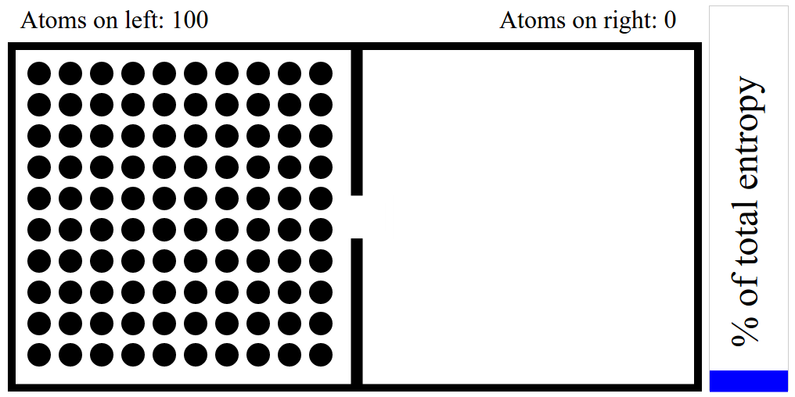
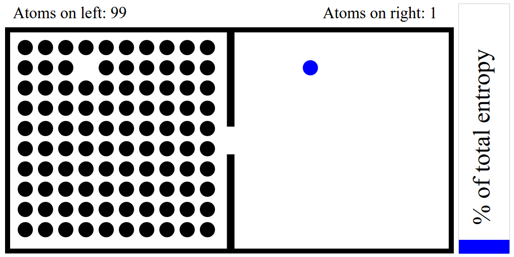
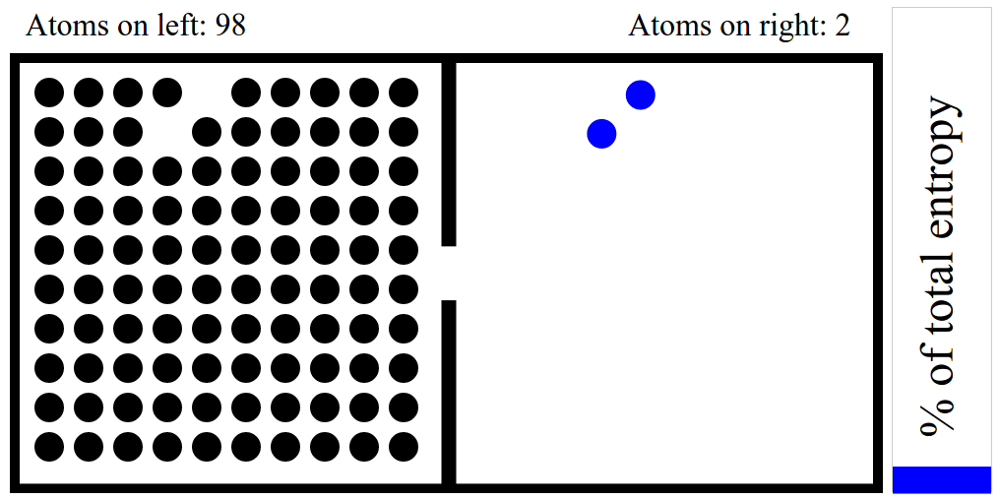

# Entropy - An explanation of the app

## Summary

Entropy is defined as the "orderliness" of a system. The second law of thermodynamics states that a system trends towards increased entropy.

This application is a simplified demonstration of what entropy means and why it increases within a system.

## Preface

First, what *is* entropy? Yes yes, I said it's the "orderliness" of a system... but what does that mean exactly?

A frequent example of entropy is an egg breaking. A chicken egg is a highly ordered collection of atoms. The atoms are arranged in a particular way as to promote the creation of a chick. What happens when you throw the egg other than being charged with vandalism?

When the egg makes contact with the target of your aggression it will break open. This is an example of *increasing* entropy; the atoms in the egg are now more disorganized.

Now, you go to your victim, apologize, pick up all the egg shells, wipe off the yolk, and then throw it at your target *AGAIN*. First, you seriously need to get some help with your anger issues. But, more importantly to the topic at-hand, the egg will not hit your target and reassemble into a functional egg. Indeed, it will likely become *more* disorganized as some of the shell fragments break into smaller pieces. This seems intuitively obvious, but the definition of entropy is an objective and quantitative measurement which explains why you'll never see an egg reassemble from broken fragments.

There are many ways in which the atoms in an egg can be assembled to resemble an egg. However, this is small compared to the ways in which the atoms can be assembled to look like something *OTHER* than an egg. An egg breaks but doesn't "un-break" because there are more ways for the egg to be broken than there are ways for the egg to be an egg. The "number of ways" the atoms can be arranged is how we measure entropy.

## A thought experiment

To make this more clear let's consider a very simplified example. Imagine two boxes side-by-side. Box A is filled with a gas and contains exactly 100 atoms hydrogen. Box B has nothing inside of it. The two boxes are separated except for a small hole which atoms can pass through to the other box.

How many configurations (ways) are possible in which there are 100 atoms in Box A and 0 atoms in Box B? The answer: 1. There is only one way in which all the atoms are on one side of the box.



Because there's a hole connecting the boxes there's some chance that an atom from Box A moves into Box B. Suppose exactly one atom does move to Box B. How many configurations are possible in which there are 99 atoms in Box A and 1 atom in Box B? The answer: 100. There are 100 different ways in which one of the 100 atoms from Box A moves into Box B.



Let's run this experiment again. But this time, two atoms from Box A move into Box B. How many configurations are possible in which there are 98 atoms in Box A and 2 atoms in Box B? The answer, assuming the order in which the atoms moved is not important: 4,950. The answer comes from the mathematical concept of [combinations](https://en.wikipedia.org/wiki/Combination) which calculates the number of configurations possible (ignoring order).



And how many configurations are possible as we continue adding atoms to Box B?

Atoms in Box B | Number of configurations
-------------- | ------------------------
1              | 100
2              | 4,950
3              | 161,700
4              | 3,921,225
5              | 75,287,520
6              | 10^9
7              | 10^10
8              | 10^11
9              | 10^12
...            | ...
50             | 10^29 = 100,000,000,000,000,000,000,000,000,000

The entropy increases as the number of atoms in Box B increases. Eventually, when the boxes have matching numbers of atoms, the entropy is at it's highest level with 10^29 configurations possible. As you can see, there are many more ways in which the atoms can be disorganized.

## The App

The application is a working example of the thought experiment above.

### The instructions

```
1) Place a number of atoms in one box.
2) Every atom in both boxes have a percent chance of crossing the gap into the other box.
3) Wait some number of seconds
4) Loop 2-4.
```

### The colors and what they mean

Blue represents the increase of entropy. It is blue because of the energy loss associated with increased entropy.

Red represents the decrease of entropy. Although entropy *tends* to increase it does not *always* increase. It can momentarily decrease by chance. Or it can consistently decrease if we added energy in some way, for example if a demon stood at the opening and allowed atoms to go into one box but not the other. The demon would require some sort of energy to accomplish this feat, hence the red, but it would also need to get that energy from a larger system (outside of the box) and entropy would tend to increase for that larger system.

Purple represents the stagnation of entropy. This can happen momentarily by chance, by the same demon mentioned above, and frequently when the boxes reach maximum entropy.
